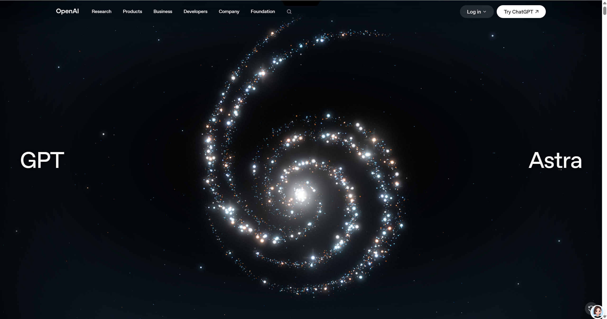

# Website Replication Skill

面向 AI 编程助手的高保真网站复刻 Skill，支持原站资源捕获、归档、本地回放及交互验证。

本项目从零设计并持续迭代网站复刻工作流，覆盖捕获、资源校验、本地服务与验收流程。

## 实战案例

[OpenAI GPT-6 Astra 页面复刻](examples/openai-gpt-6-astra/README.md)：查看镜像站与原站截图对比，以及粒子渲染效果的排查与修复思路。



## 工作方式

默认以高保真镜像为目标，优先复用原站 HTML、CSS、JavaScript、字体、图片及动画资源。需要持续开发、调整布局或增加功能时，再采用可维护重建。

工作流：识别网站形态 → 明确页面与交互范围 → 浏览器捕获 → 资源归档 → 本地回放 → 验证与补抓。

## 安装与使用

需要 Node.js 20+。将本仓库放入支持本地 Skill 的 AI 编程助手的技能目录，目录名建议为 `replicating-frontend-websites`。入口为 [SKILL.md](SKILL.md)。

在本仓库目录执行：

```sh
npm install
npx playwright install chromium
node scripts/doctor.js
```

向助手描述目标网站、所需页面和关键交互，例如：

> 使用 replicating-frontend-websites 复刻这个网站，按高保真镜像交付，核对桌面和移动端的页面、动画与关键交互。

详细命令和分流手册见 [SKILL.md](SKILL.md) 与 [references](references)。

## 目录

- `SKILL.md`：工作流与质量要求。
- `scripts/`：环境检查、指纹识别、捕获、归档、回放与验证工具。
- `references/`：静态站、SPA/SSR、WebGL、数据快照及验证手册。
- `tests/`：基于本地样例的工具测试，运行 `npm test`。

## 能力边界

捕获覆盖的是实际访问过的页面与状态；复杂运行时可能需要站点专用适配。后端服务、未捕获的交互和外部嵌入内容需要单独处理。资源校验通过不等于视觉一致，仍需在对应视口和状态下对照截图验收。
