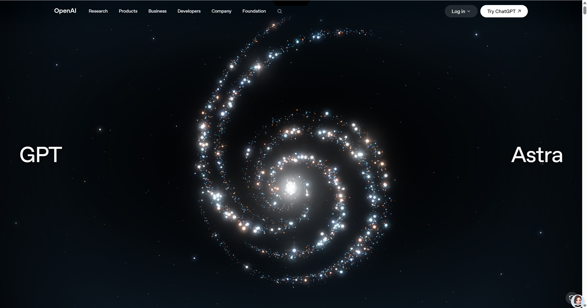

# OpenAI GPT-6 Astra 页面复刻

使用本 Skill 对 [OpenAI GPT-6 Astra 页面](https://openai.com/index/gpt-6-astra/)进行高保真复刻，将原站前端资源与运行时迁移至本地，还原页面布局、视觉效果和粒子动画。

## 效果对比

可运行项目见 [project](project/README.md)。安装 Node.js 20+，进入该目录执行 `npm start`，然后打开 http://127.0.0.1:8080/。

以下为复刻效果的截图：P1 为本地镜像，P2 为原站。从导航、标题到背景和粒子旋臂，视觉效果已基本一致。

### P1 · 本地镜像

### P2 · 原站

## 实现思路

1. 识别页面使用的前端运行时、资源与 WebGL 动画依赖，明确需要捕获的页面和交互状态。
2. 通过浏览器捕获页面及已访问状态的资源响应，归档原始内容和请求映射。
3. 在本地提供资源回放，并针对站点运行时进行适配。
4. 对照原站检查页面布局、资源加载与粒子渲染效果，针对差异继续修复。

## 关键问题：粒子效果偏稀疏

初版镜像的粒子密度、亮度和光晕弱于原站。通过排查渲染配置，针对该站点调整质量分档、粒子预算和后处理设置，并对照原站修复视觉差异。

粒子效果还原是本案例的重点之一，需要同时核对资源完整性与运行时渲染配置。

## 项目实现

本 Skill 从零设计并开发，将网站识别、浏览器捕获、资源归档、本地回放和验证补抓整合为可重复使用的流程。本案例用于实战验证，重点解决运行时适配和粒子效果还原问题。

原站页面设计、品牌与粒子动画资源来自 OpenAI。
